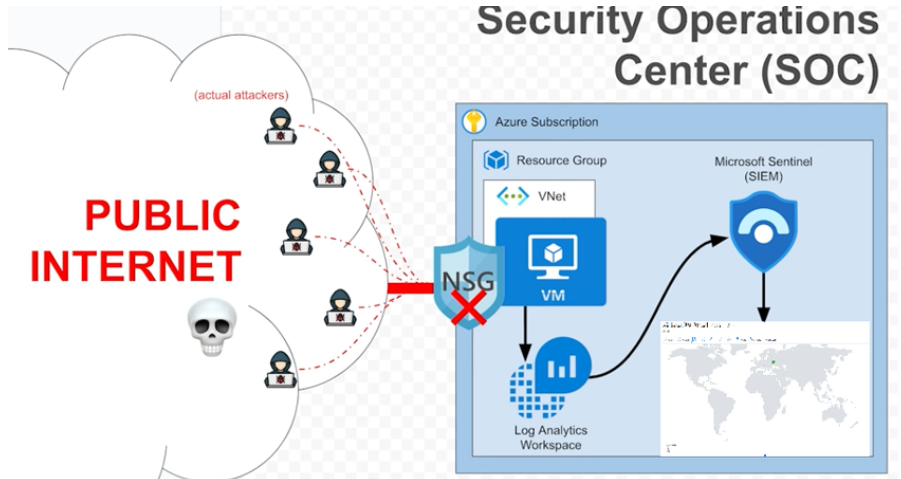
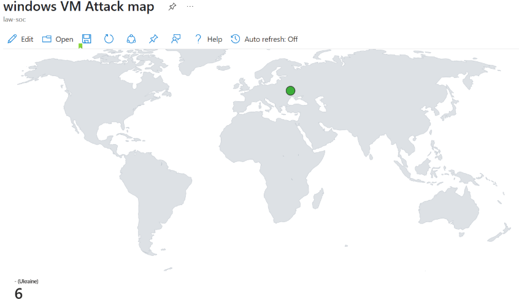
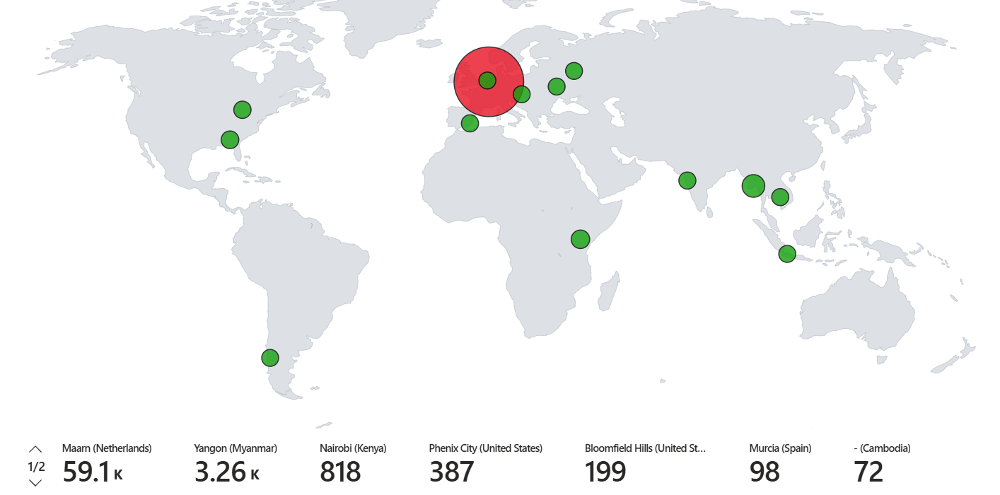
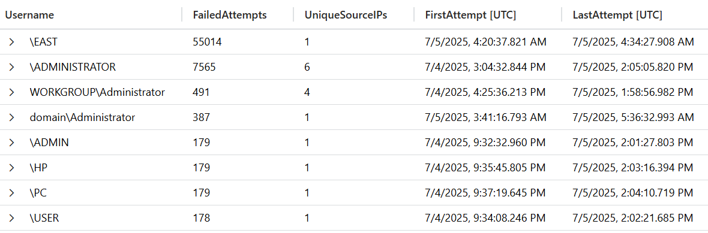

# SOC

- Creating an Azure subscription and setting up a VM
- Configuring Log Analytics Workspace
- Forwarding logs and integrating with Sentinel
- Querying failed login attempts and visualizing attack sources
- Building an attack map to track real-time hacker activity

##Project overview 

##Map after 0h

##Map after 24h

##Statistics

